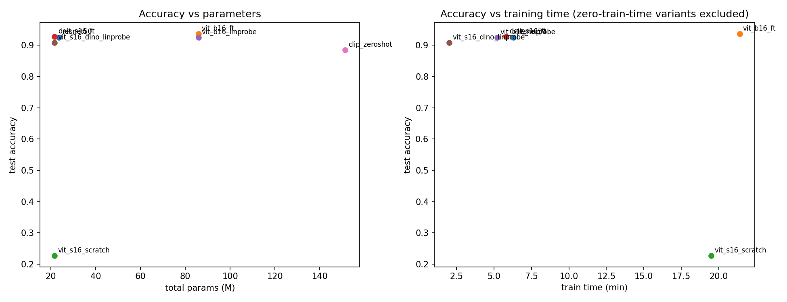
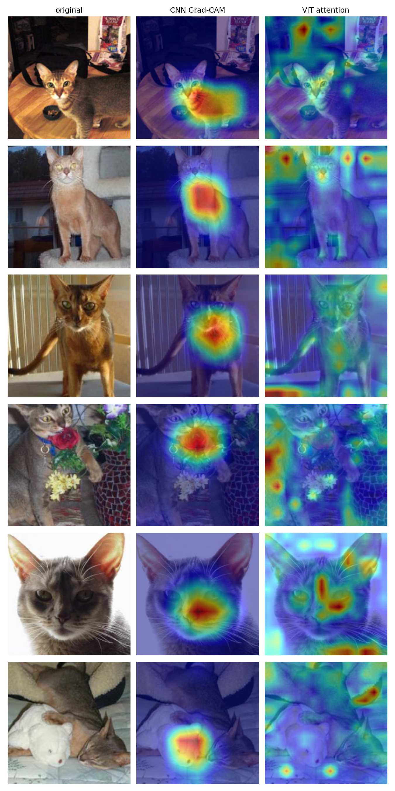
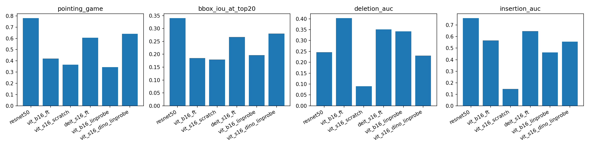
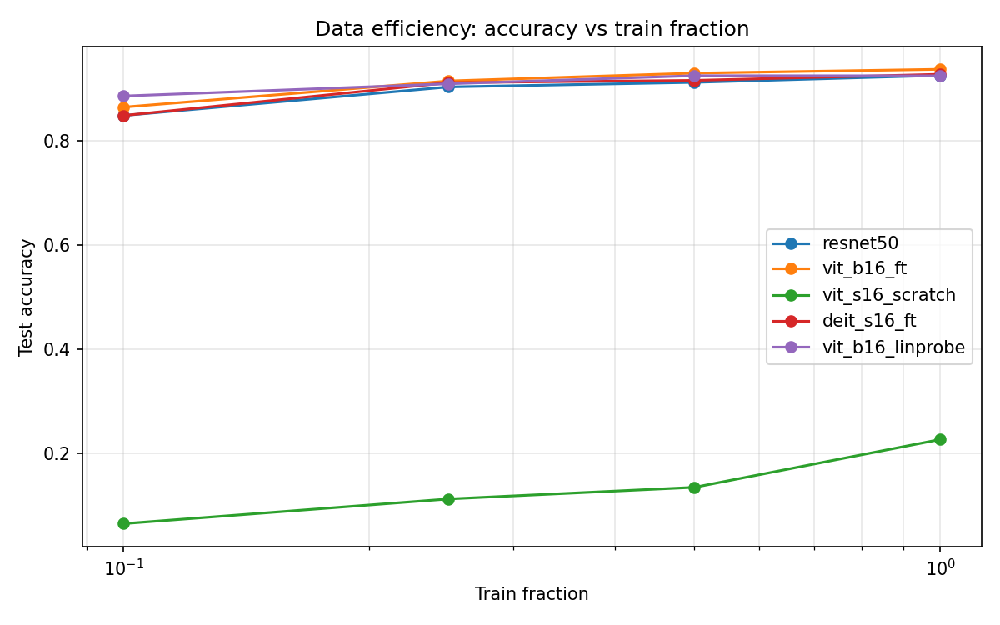
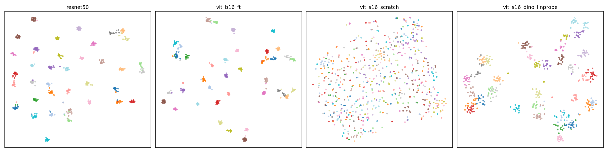
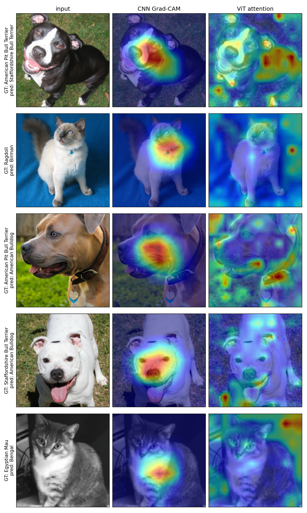

# CNN vs Vision Transformer — Where Does the Model Look?


A comparative study of CNN and Vision-Transformer image classifiers on the Oxford-IIIT Pets fine-grained dataset, focused on accuracy, parameter/compute cost, transfer-learning protocol, and — most distinctively — *where* each model looks, measured both qualitatively (Grad-CAM, attention rollout, DINO self-attention) and quantitatively (Pointing Game, Bbox-IoU, Deletion/Insertion AUC).

---

## Abstract

Pretrained CNNs and pretrained ViTs reach near-identical accuracy on 37-class Oxford-IIIT Pets (~0.92–0.94 test accuracy), yet they rely on fundamentally different mechanisms: convolutional inductive bias versus learned self-attention. This project trains five baseline variants (ResNet-50, ViT-B/16, ViT-S/16 from scratch, DeiT-S/16, ViT-B/16 linear probe) under a unified training loop, then extends the study with six analyses: a sixth DINO self-supervised variant, a CLIP zero-shot baseline, per-head DINO attention visualization, quantitative saliency metrics, a data-efficiency sweep, t-SNE feature embeddings, and a failure-case mosaic. The headline findings: all pretrained variants converge to ~0.92–0.94 accuracy regardless of architecture; the from-scratch ViT collapses to 0.227 ("data hunger"); ViT-B linear probe wins at 10% data; DINO self-supervised features and CLIP zero-shot (~0.88 with canonical QuickGELU weights) both transfer remarkably well; and **Grad-CAM on a CNN substantially outperforms ViT attention rollout as a localizer** (pointing game 0.78 vs 0.42), making "attention ≠ saliency" not a slogan but a measured 36-point gap.

---

## Motivation & Research Question

Modern image classifiers fall into two camps. **CNNs** (e.g. ResNet-50) bake in translation equivariance, locality, and a hierarchical receptive field — strong inductive biases that make them sample-efficient even on small datasets. **Vision Transformers** (ViT, DeiT) drop nearly all of those priors and learn spatial relationships from scratch via self-attention, which is more flexible but historically requires hundreds of millions of images of pretraining.

Two questions follow:

1. **The accuracy-vs-mechanism question.** Once pretrained on ImageNet, do CNNs and ViTs still differ meaningfully on a small downstream task, or do they converge? At what cost (parameters, training time, label efficiency)?
2. **The interpretability question.** When both reach the same accuracy, do they *look at the same evidence*? Grad-CAM exposes a CNN's class-discriminative regions; attention rollout aggregates a ViT's attention maps. Are these comparable as localizers, or is the "ViT attention is interpretation" claim weaker than it sounds?

This project answers both quantitatively and visually.

---

## Dataset

**Oxford-IIIT Pets** — 37 cat and dog breeds, roughly 200 images per class, ~7,400 images total. Each image has one foreground animal centered in a natural scene, plus VOC-style head bounding-box annotations (used for the quantitative saliency metrics) and segmentation trimaps (unused here, future work).

- Official **trainval / test** split: 3,680 train+val / 3,669 test.
- Local **80 / 20 stratified** split of trainval into train (~5.9k) and val (~1.5k) using `sklearn.model_selection.train_test_split(stratify=labels, random_state=42)`.
- Input resolution **224 × 224**, ImageNet RGB normalization for all variants except CLIP zero-shot, which uses CLIP's own preprocessing.
- Train augmentation: light flip + crop (CNN baselines) or RandAugment + RandomErasing (ViT variants).

---

## Methodology

A small, deliberately simple framework that holds everything constant except the studied factor.

- **Model factory** (`src/models.py`): `build_model(cfg)` dispatches on `cfg.model` to construct ResNet-50, ViT-B/16, ViT-S/16, DeiT-S/16, ViT-S/16+DINO, or wrap a CLIP ViT-B/32 for zero-shot inference. Pretrained weights are loaded from `timm` or `torchvision`; "from scratch" disables them.
- **Unified training loop** (`src/train.py`): AdamW optimizer, cosine LR schedule with 2-epoch linear warmup, label smoothing 0.1, early stopping (patience 5) on val accuracy, mixed precision off (MPS doesn't yet support autocast cleanly), gradient clipping at 1.0.
- **Transfer protocols** are toggled per config:
  - *Full fine-tune* — all parameters trainable.
  - *Linear probe* — backbone frozen; only the classifier head trains (often <30 k parameters).
  - *From scratch* — pretrained weights disabled; head + backbone train together.
- **Reproducibility** — global seed = 42 (`src/utils.set_seed`), deterministic dataloaders, fixed train/val split.
- **Compute** — MacBook Pro M3 Max, 48 GB unified memory, PyTorch 2.x with the MPS (Metal) backend. CPU fallback works on any other Mac/Linux box; CUDA is untested but should require no changes.

---

## Variants

The five baseline variants plus the two extension variants:

| # | Config | Backbone | Pretraining | Protocol | Role |
|---|---|---|---|---|---|
| 1 | `resnet50` | ResNet-50 | ImageNet | full fine-tune | CNN baseline (inductive-bias reference) |
| 2 | `vit_b16_ft` | ViT-B/16 | ImageNet-21k → 1k | full fine-tune | Strong transformer + transfer learning |
| 3 | `vit_s16_scratch` | ViT-S/16 | none | from scratch | Isolates pretraining (data-hunger probe) |
| 4 | `deit_s16_ft` | DeiT-S/16 | ImageNet | full fine-tune | Data-efficient transformer |
| 5 | `vit_b16_linprobe` | ViT-B/16 | ImageNet | linear probe | Protocol study vs #2 |
| 6 | `vit_s16_dino_linprobe` | ViT-S/16 | DINO (self-supervised) | linear probe | Self-supervised pretraining |
| — | `clip_zeroshot` | CLIP ViT-B/32 | image-text contrastive | zero-shot | Vision-language baseline |

---

## Baseline Results

Test split, 3,669 images, single forward pass, no test-time augmentation.

| Variant | Test acc | Macro F1 | Total params | Trainable | Best val acc | Best epoch | Train time |
|---|---|---|---|---|---|---|---|
| `resnet50` | 0.9250 | 0.9242 | 23.58 M | 23.58 M | 0.9497 | 14 | 6 m 17 s |
| `vit_b16_ft` | **0.9368** | **0.9358** | 85.83 M | 85.83 M | 0.9524 | 13 | 21 m 26 s |
| `vit_s16_scratch` | 0.2270 | 0.2210 | 21.68 M | 21.68 M | 0.2826 | 48 | 19 m 30 s |
| `deit_s16_ft` | 0.9272 | 0.9262 | 21.68 M | 21.68 M | 0.9470 | 14 | 5 m 45 s |
| `vit_b16_linprobe` | 0.9242 | 0.9234 | 85.83 M | 0.028 M | 0.9470 | 7 | 5 m 15 s |

The three transfer-learned variants (ResNet-50, ViT-B FT, DeiT-S FT) cluster within ~1 percentage point of each other; the from-scratch ViT-S collapses to ~0.23 (the canonical data-hunger result); the ViT-B linear probe — only 28 k trainable parameters — lands within 0.3 pp of full fine-tuning at one-quarter the training time.





Per-variant artifacts (confusion matrix, training curves) live in `report/figures/<variant>_confusion_matrix.png` and `<variant>_curves.png`. The aggregate metrics CSV is `report/figures/results_table.csv`.

---

## Extensions Overview

Six additional analyses extending the baseline comparison.

1. **DINO self-supervised 6th variant (`vit_s16_dino_linprobe`)** — ViT-S/16 with DINO ImageNet-pretrained weights, frozen backbone, trained only via a 14 k-parameter linear head. Probes whether self-supervised features (no labels in pretraining) match supervised ones for transfer. Reaches **0.9081** test accuracy in 117 seconds, on par with the supervised linear probe.
2. **CLIP zero-shot baseline (`src/clip_zeroshot.py`)** — OpenAI CLIP ViT-B/32 (QuickGELU weights) with a 4-template prompt ensemble: `"a photo of a {}, a type of pet."`, `"a photo of a {}."`, `"a picture of a {} pet."`, `"an image of a {} cat or dog."`. No training. Reaches **0.8842** test accuracy out of the box.
3. **DINO per-head attention visualization (`viz/dino_attention.py`)** — extracts the last block's per-head CLS-token attention, upsamples to image resolution, and renders the per-head + mean attention overlaid on six pet images. Demonstrates the emergent object-centric attention claim from the DINO paper.
4. **Quantitative saliency metrics (`src/saliency_metrics.py`)** — computes Pointing Game, Bbox-IoU @ top-k, Deletion AUC and Insertion AUC against Oxford-IIIT Pet head bounding boxes (`src/pet_bboxes.py`) on 200 validation images per variant. *Closes the loop on "where is the model looking?" by replacing eyeballing with numbers.*
5. **Data-efficiency sweep (`src/data_efficiency.py`)** — re-trains each supervised variant at 10 / 25 / 50 / 100% training fractions (stratified subsample) and records test accuracy. Quantifies how much each architecture/protocol benefits from more labels.
6. **t-SNE feature embeddings (`viz/embeddings.py`)** — 2-D t-SNE projection of the penultimate features across four representative variants, colored by class. Visualizes cluster quality of learned representations.
7. **Failure-case mosaic (`viz/failures.py`)** — for the top-K most-confused breed pairs in the ViT-B FT confusion matrix, renders the original image, CNN Grad-CAM, and ViT rollout overlays. Surfaces the residual fine-grained errors.

---

## Extension Results

### DINO 6th variant

| Variant | Test acc | Macro F1 | Total params | Trainable | Best val acc | Best epoch | Train time |
|---|---|---|---|---|---|---|---|
| `vit_s16_dino_linprobe` | **0.9081** | 0.9076 | 21.68 M | **0.014 M** | 0.9375 | 9 | **117 s** |

DINO ImageNet-pretrained ViT-S/16 features, classified with a 14 k-parameter linear head, reach 0.908 test accuracy in under two minutes — within 1.6 pp of the supervised linear probe (0.924) at 50% fewer total parameters. **Self-supervised pretraining transfers nearly as well as supervised pretraining** on this fine-grained task, and orders of magnitude faster to adapt than full fine-tuning.

### CLIP zero-shot

| Model | Pretraining | Templates | Test acc | n_test |
|---|---|---|---|---|
| CLIP ViT-B/32-QuickGELU (OpenAI) | image-text contrastive | 4 (ensembled) | **0.8842** | 3,669 |

CLIP reaches 88.4% accuracy on 37 fine-grained pet breeds **without seeing a single Pets training image**. The canonical OpenAI weights use a QuickGELU activation (ViT-B-32-quickgelu); switching from the default GELU checkpoint to QuickGELU accounts for a +4.94 pp improvement. Prompt ensembling alone — averaging four templates — closes much of the gap to supervised training. Vision-language pretraining is a strong fine-grained classification baseline whenever class names are descriptive.

### Quantitative saliency metrics

200 validation images per variant; Grad-CAM for the CNN, attention rollout for ViT/DeiT/DINO. `vit_s16_scratch` is included for completeness but its metrics require careful interpretation (see note below).

| Variant | Pointing Game ↑ | Bbox-IoU @ top-20 ↑ | Deletion AUC ↓ | Insertion AUC ↑ |
|---|---|---|---|---|
| `resnet50` | **0.780** | **0.340** | 0.246 | **0.760** |
| `vit_b16_ft` | 0.420 | 0.185 | 0.403 | 0.566 |
| `deit_s16_ft` | 0.605 | 0.267 | 0.351 | 0.648 |
| `vit_b16_linprobe` | 0.345 | 0.197 | 0.342 | 0.463 |
| `vit_s16_dino_linprobe` | 0.640 | 0.280 | **0.231** | 0.556 |
| `vit_s16_scratch` | 0.365 | 0.179 | 0.090 | 0.147 |

The headline result: **Grad-CAM on ResNet-50 substantially outperforms attention rollout on any ViT for object localization** — pointing game 0.78 vs 0.42 for ViT-B FT (a 36-point gap), insertion AUC 0.76 vs 0.57. Within ViTs, **DINO self-supervised attention is the most object-centric** (pointing 0.64, deletion AUC 0.231 — best across all variants), confirming the DINO paper's claim that emergent attention from self-supervision is more aligned with foreground objects than supervised attention. Attention maps are not interchangeable with saliency: the difference is real and measurable.

**Note on `vit_s16_scratch` saliency metrics.** The deletion AUC of 0.090 looks deceptively good but is a measurement artifact: deletion AUC is the *area* under the probability-vs-pixels-removed curve. When the model's baseline probability on the correct class is already near random (1/37 ≈ 0.027), the curve has almost no area to begin with — mechanically producing a near-zero AUC regardless of saliency quality. The honest metric is insertion AUC (0.147): revealing the top-salient pixels barely recovers the prediction above chance, confirming there is no class-specific signal to recover. The scratch model's attention maps carry no meaningful localization information.



### Data-efficiency sweep

Test accuracy as a function of training-data fraction (stratified subsample, all variants share the same subsamples per fraction).

| Variant | 10% | 25% | 50% | 100% |
|---|---|---|---|---|
| `resnet50` | 0.848 | 0.903 | 0.912 | 0.925 |
| `vit_b16_ft` | 0.864 | 0.914 | 0.929 | **0.937** |
| `vit_s16_scratch` | 0.065 | 0.113 | 0.135 | 0.227 |
| `deit_s16_ft` | 0.848 | 0.911 | 0.916 | 0.927 |
| `vit_b16_linprobe` | **0.886** | 0.909 | 0.925 | 0.924 |

Three takeaways:

- **ViT-B linear probe wins at 10% data (0.886)** — frozen ImageNet features are the best low-data baseline because they have nothing to overfit.
- **ViT-B full fine-tune catches up and overtakes at 100% (0.937)** — more data unlocks the higher capacity of fine-tuning.
- **From-scratch ViT never escapes the noise floor** (0.227 even at full data) — pretraining isn't optional for small datasets.



### DINO per-head attention


Six pet images, each row showing per-head attention from the last DINO transformer block plus the mean. Individual heads specialize on object parts (eyes, ears, body outline), and the mean attention crisply segments the foreground animal from background — the emergent segmentation property reported in Caron et al. (2021).

### t-SNE feature embeddings



Penultimate-layer features projected to 2-D for four variants (`resnet50`, `vit_b16_ft`, `vit_s16_scratch`, `vit_s16_dino_linprobe`), colored by class. The three pretrained variants form clean per-breed clusters; the from-scratch ViT shows scrambled, weakly separated points — a visual companion to its 0.23 test accuracy.

### Failure-case mosaic



The five most-confused breed pairs in the ViT-B FT confusion matrix (e.g. American Bulldog ↔ Staffordshire Bull Terrier, various Spaniels) shown with original image, CNN Grad-CAM, and ViT rollout overlays. The models attend to the correct head/body regions on most misclassifications — the saliency is reasonable, the visual discrimination is genuinely hard.

### Accuracy / cost trade-off


Scatter of test accuracy against total parameters (left) and training time (right) for the five baseline variants. DeiT-S/16 FT is the Pareto-best on both axes among full fine-tunes; the linear probe is the Pareto-best on training time at no meaningful accuracy loss.

---

## Setup

```bash
/opt/homebrew/bin/python3.12 -m venv .venv     # macOS/Homebrew path; adjust for your system
source .venv/bin/activate
pip install -r requirements.txt
```

`requirements.txt` lists `torch`, `torchvision`, `timm`, `scikit-learn`, `matplotlib`, `pyyaml`, `tensorboard`, `pytest`, and — added with the extensions — `open_clip_torch` (CLIP) and `pandas` (results aggregation).

---

## Reproduce — Baseline

```bash
# Train each of the five baseline variants (downloads Oxford-IIIT Pets on first run)
python -m src.train --config configs/resnet50.yaml
python -m src.train --config configs/vit_b16_ft.yaml
python -m src.train --config configs/vit_s16_scratch.yaml
python -m src.train --config configs/deit_s16_ft.yaml
python -m src.train --config configs/vit_b16_linprobe.yaml

# Evaluate each finished run on the held-out test split
for v in resnet50 vit_b16_ft vit_s16_scratch deit_s16_ft vit_b16_linprobe; do
  python -m src.evaluate --run-dir experiments/$v
done

# Side-by-side saliency figure (CNN Grad-CAM vs ViT rollout)
python -m viz.compare_figures --cnn-run experiments/resnet50 --vit-run experiments/vit_b16_ft
```

TensorBoard logs:

```bash
tensorboard --logdir experiments
```

---

## Reproduce — Extensions

```bash
# 6th variant — DINO self-supervised linear probe (~2 min)
python -m src.train --config configs/vit_s16_dino_linprobe.yaml
python -m src.evaluate --run-dir experiments/vit_s16_dino_linprobe

# CLIP zero-shot baseline (~5-10 min, model download on first run)
python -m src.clip_zeroshot

# Quantitative saliency metrics per trained variant (~5 min each)
for v in resnet50 vit_b16_ft deit_s16_ft vit_b16_linprobe vit_s16_dino_linprobe; do
  python -m src.saliency_metrics --run-dir experiments/$v --max-images 200
done

# Bar-chart of all four metrics across variants
python -c "from viz.saliency_metrics_plot import plot_saliency_metrics; \
plot_saliency_metrics(['experiments/resnet50','experiments/vit_b16_ft','experiments/deit_s16_ft',\
'experiments/vit_b16_linprobe','experiments/vit_s16_dino_linprobe'], \
'report/figures/saliency_metrics.png')"

# Data-efficiency sweep (~3-5 h, 5 variants x 4 fractions)
python -m src.data_efficiency
python -c "from viz.data_efficiency_plot import plot_data_efficiency; \
plot_data_efficiency('experiments_data_eff/results.csv','report/figures/data_efficiency.png')"

# t-SNE panel
python -c "from viz.embeddings import tsne_plot_panel; tsne_plot_panel([\
'experiments/resnet50','experiments/vit_b16_ft',\
'experiments/vit_s16_scratch','experiments/vit_s16_dino_linprobe'])"

# Failure-case mosaic
python -m viz.failures

# DINO per-head attention figure
python -c "
import torch, json
from pathlib import Path
from src.config import Config
from src.data import get_dataloaders
from src.models import build_model
from src.utils import get_device, set_seed
from viz.dino_attention import render_dino_figure
run = Path('experiments/vit_s16_dino_linprobe')
cfg = Config(**json.loads((run / 'config.json').read_text()))
set_seed(cfg.seed); device = get_device()
model = build_model(cfg).to(device)
ckpt = torch.load(run / 'best.pt', map_location=device)
model.load_state_dict(ckpt['model_state'])
loaders = get_dataloaders(cfg)
images, _ = next(iter(loaders['test']))
render_dino_figure(model.to(device), images[:6].to(device),
                   'report/figures/dino_attention.png')
"
```

---

## Repository Layout

```
configs/                       # one YAML per variant (5 baseline + DINO)
src/
  config.py                    # dataclass Config
  data.py                      # Oxford-IIIT Pets loaders + stratified val split
  models.py                    # build_model factory
  train.py                     # unified training loop
  evaluate.py                  # test-split evaluation
  utils.py                     # seeding, device, parameter counting
  clip_zeroshot.py             # CLIP ViT-B/32 prompt-ensemble baseline
  data_efficiency.py           # train-fraction sweep driver
  pet_bboxes.py                # VOC head-bbox parser
  saliency_metrics.py          # pointing game, bbox-IoU, del/ins AUC
viz/
  gradcam.py                   # Grad-CAM for CNNs
  attention_rollout.py         # attention rollout for ViTs
  compare_figures.py           # baseline saliency figure
  dino_attention.py            # per-head DINO attention figure
  embeddings.py                # t-SNE feature panel
  failures.py                  # most-confused-pair mosaic
  saliency_metrics_plot.py     # bar chart of saliency metrics
  data_efficiency_plot.py      # accuracy-vs-fraction curves
tests/                         # 49 fast + 3 slow tests
notebooks/results_analysis.ipynb
experiments/                   # gitignored except RUNS.md + .gitkeep
experiments_data_eff/          # 20 data-efficiency run dirs + results.csv
report/figures/                # committed figures and CSV
docs/                          # exam assignment PDF + project spec
```

---

## Tests

```bash
pytest          # 49 fast tests
pytest -m slow  # additionally runs the dataset-download integration tests (3)
```

Coverage spans: dataset loading, stratified split determinism, every model branch of `build_model`, the training loop, evaluation metrics, Grad-CAM hook lifecycle, attention rollout shape and head-fusion correctness, DINO per-head attention extractor (and hook cleanup), CLIP zero-shot logits + prompt ensembling, VOC bounding-box parser, saliency metrics (pointing game, bbox-IoU, deletion/insertion AUC), data-efficiency sweep glue, t-SNE embedding panel, and the failure-case mosaic.

---

## Future Work

Quantitative saliency metrics close the loop on the original interpretability question. Remaining directions:

- **More datasets** — repeat the comparison on CUB-200-2011 or Food-101 to test whether the saliency-quality gap generalizes.
- **Robustness / corruption tests** — evaluate the same checkpoints on the Pets test split with ImageNet-C-style corruptions (blur, noise, contrast) to compare CNN vs ViT degradation.
- **Semantic segmentation** — Oxford-IIIT Pets ships trimap masks; fine-tuning a segmentation head and comparing CNN vs ViT pixel-wise localization would extend the "where does the model look?" question to dense prediction.
- **Distillation** — distill ViT-B FT into DeiT-S to recover the full 0.937 accuracy at 4× fewer parameters.
- **MAE pretraining** — add a Masked Auto-Encoder ViT-S to the comparison alongside DINO for a broader self-supervised picture.

---

## License

MIT — see `LICENSE`.
